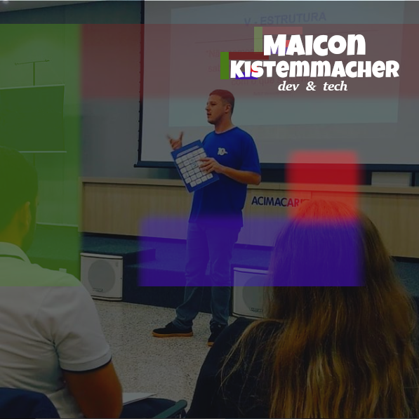

 
  
<h4>Full Stack Developer 
    Graduated in Internet Systems Technology   
    Specialist in Computer Networks and IT Support Services   
    Large user of free software and GNU / Linux distributions</h4>
  
  
  
    

  
                                          

 

